# SA_project
>110 系統分析與設計

1.軟體需求規格書（Software Requirement Specification, SRS）係指描述軟體產品、專案之主要使用者、功能性與非功能性之需求規格。
藉由本文釐清使用者之需求，以作為系統軟體分析與設計之基礎，並可於測試與驗收階段作為依憑。
 
 
2.本文件之目標讀者為專案經理、主要使用者、專案開發相關人員及測試人員等，
對主要使用者提供系統相關資訊，以了解系統之運作流程與使用方式、對系統開
發與測試者，用以建構統一且明確之未來實作方針，並用於驗收與測試之憑據、
對於專案經理用於控管專案之進行順利、時程安排與進度之確認。

---

## EZ訂火車系統
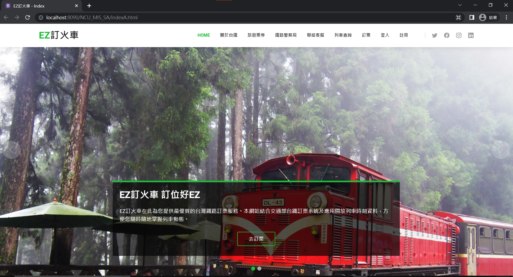
### 專案簡介
中央大學學生準備提供線上火車訂票服務，功能包含提供客戶線上瀏覽火車班次資訊、動態及訂票服務。

---

## 系統範圍
本系統範圍用於火車訂票，其中主要包含會員、列車時刻、訂票與結帳、我的車票、列車資訊、管理者管理七個模組，
並且能進行相關新增、查閱與維護工作，藉由此系統支持完成火車訂票所需的管理流程。

---

## 技術需求
1. 本專案預計使用 Java、XAMPP 等開放式語言進行網站之開發，並提供權限之
管理。
2. 專案開發階段預計採用 Apache、MySQL 等社群版軟體進行。
3. 前後端之溝通與 API 之存取採用 JSON 格式進行溝通。
4. 與台鐵API銜接，取得台鐵動態資料
5. 由於本系統將含有大量個人資料，資訊安全之保護須納入設計考量。

---

## 軟體需求
1. Java JDK Version：Oracle JDK 15
2. Application Server：Apache Tomcat 9.0.38
3. Database：Oracle MySQL Community 8.0.17.0
4. Workbench：Oracle MySQL Workbench Community Edition 8.0.17
5. IDE：Microsoft Visual Studio Code 1.37.1
6. 專案類型：Java Servlet 4.0
7. 程式語言：Java

### 前端套件
1. JQuery-3.4.1
2. CakePHP CSS

### 後端套件
1. json-20180813.jar：用於解析 JSON 格式
2. mysql-connector-java-8.0.17.jar：用於進行 JDBC 連線
3. servlet-api.jar：tomcat 運行 servlet 所需

---

## 使用案例圖
本線上訂購系統預計共有3位動作者與27個使用案例，並依照不同之模組區分成不同子系統共計七個子系統，
其中包含以下：會員管理子系統、列車時刻子系統、訂票子系統、結帳訂票子系統、
我的車票子系統、列車資訊子系統、管理者子系統，如下圖所示:
 

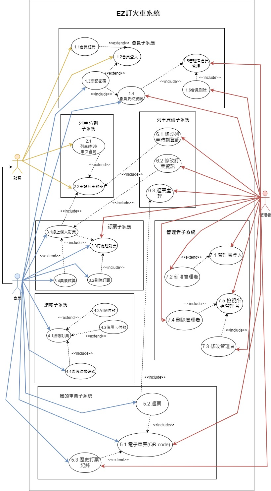

---

## 活動圖
> 舉一為例

根據上圖所分析之使用案例規格，需先逐一將每個使用案例轉換成活動圖，並逐一詳細闡述，並且進行分析。

### 線上個人訂票
商業流程編號「線上個人訂票」之主要流程如下所示：
1. 會員選擇出發車站、抵達車站、出發時間(日期、時段)、車種、車票張數，
按查詢鈕
2. include::車站列車動態
3. 系統顯示此日期，未來時段中的可訂購車次的欄位區域
4. 會員點擊送出「訂票」按鈕
5. 系統把此訂票加入待處理訂票
6. include::待處理訂票
7. 客戶選返回線上個人訂票，繼續訂購其他車票

**因為<<include>>包含關係表示是同一個使用案例，所以建立的活動圖已經展開包含關係的車站列車動態和待處理訂票使用案例，
透過以上主流程可將其轉換成活動圖，如下圖所示:**
  
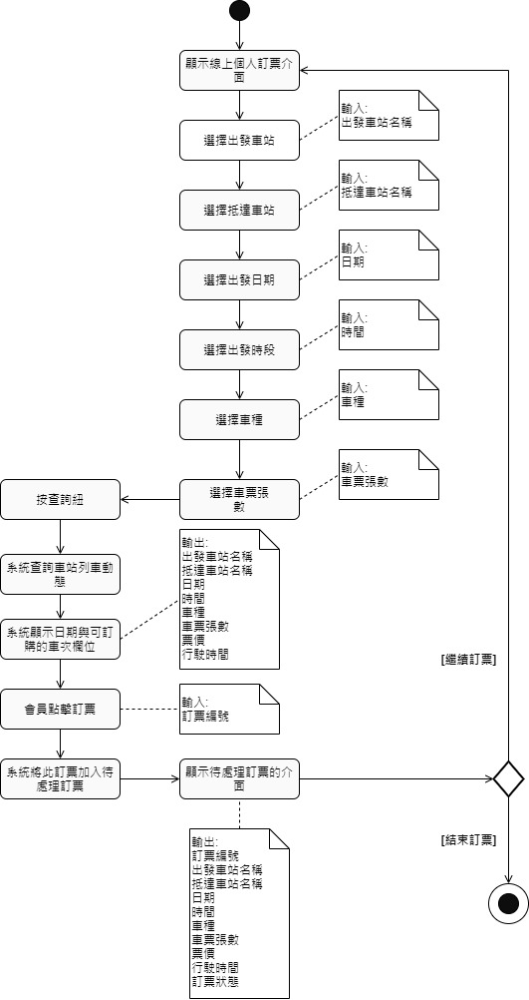

---
  
## 實體關係圖

資料庫設計採用實體關係圖(Entity-Relation Diagram)表示，並根據管理者與使用者之需求進行歸納與整理初步之系統條件。
  
以下詳述系統之資料庫需求，並將其整理成下圖之實體關係圖共計包含 5 個實體(Entity)、6 個關係(Relationship)、0 個複合性實體(Compound
Entity)：
  

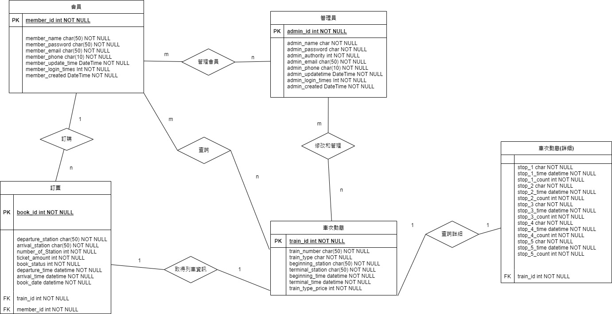

---
  
## 類別圖
下圖係依據 EZ 訂火車系統的分析模型和建立的互動圖，以及實體關係圖（Entity-Relation Diagram）所繪製之設計階段之類別圖（Class Diagram），用於描述系統的類別集合，包含其中之屬性，與類別之間的關係。
  
類別圖之說明如下所列：類別圖除包含與資料庫相對應之物件外，亦包含相關之控制物件（controller）、
DBMgr 與各功能相對應資料庫操作類別（例如：MemberHelper）和相對應之類別工具（JsonReader）。
  
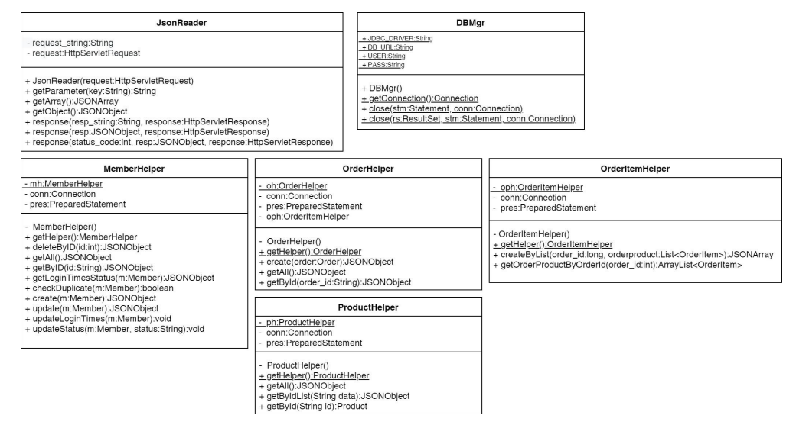
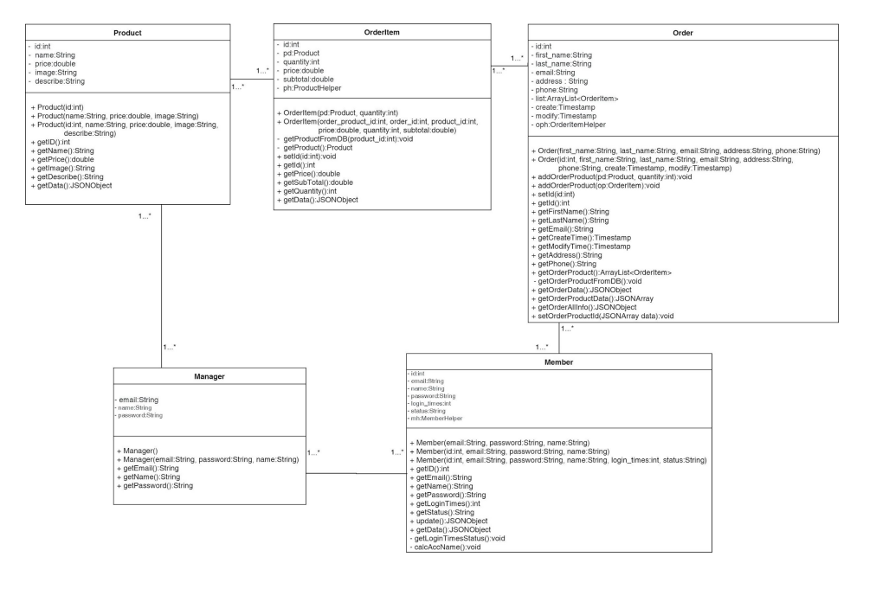
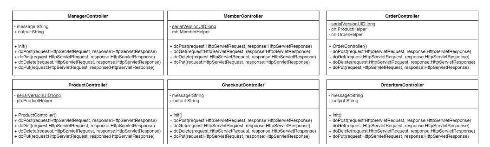
  
---
  
## 系統循序圖 
> 舉一為例

主要依照使用案例圖（use case）與活動圖為基礎，進行設計階段之循序圖設計，將每個使用案例進行闡述。於此段，
需要有明確之類別（class）名稱與呼叫之方法（method）與傳入之變數名稱與型態等細部設計之內容。
	
### Sequence Diagram—Use Case會員訂票
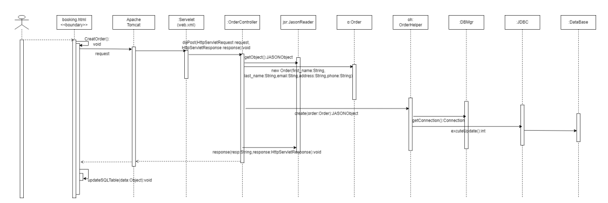

1. 當顧客登入後即可進入訂票頁面（booking.html）。
2. 當顧客完成表單之填寫並通過前端之資料驗證後，透過 JavaScript 之
submit()送出 POST 請求。
3. 後端以 OrderController 之 doPost()進行處理，以 JsonReader 取回 request 之
參數，使用 OrderHelper 物件之 create()新增該名會員資料至資料庫當中。
4. 回傳訂票之結果後，若訂票成功則透過 JavaScript 之 updateSQLTable()更新
SQL 表格內之內
	
---

## 實作畫面截圖
### 登入
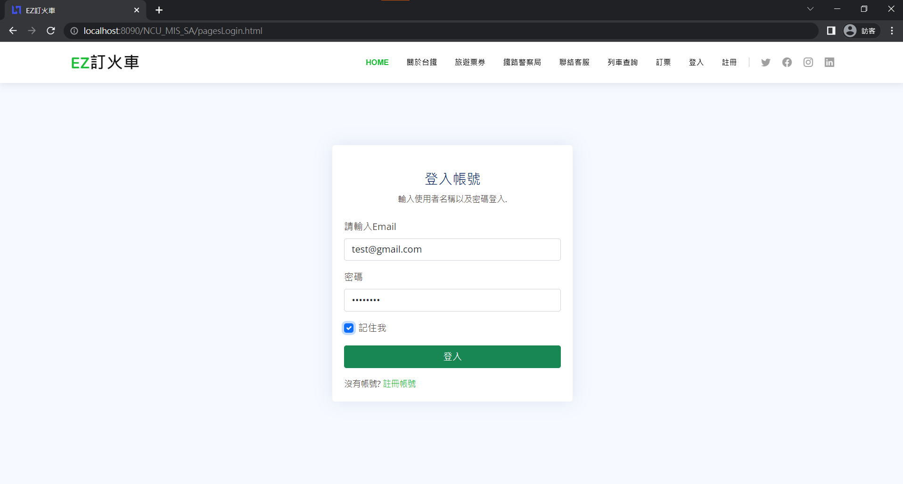

### 選取列車資訊
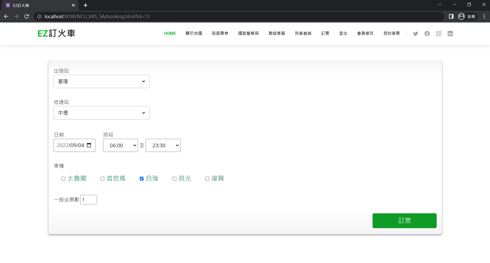

### 訂票
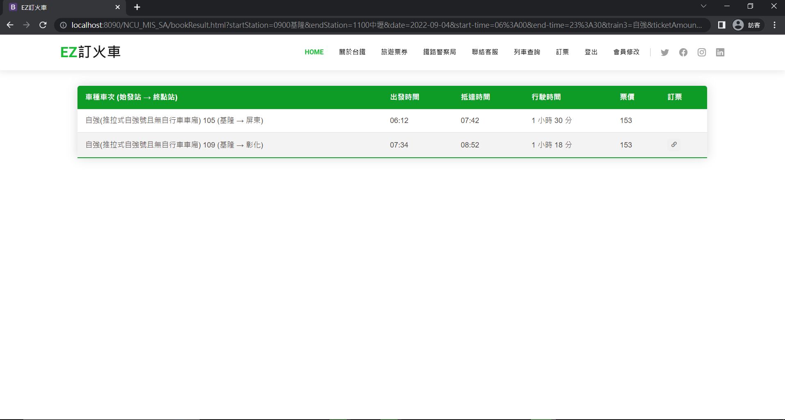
	
### 結帳
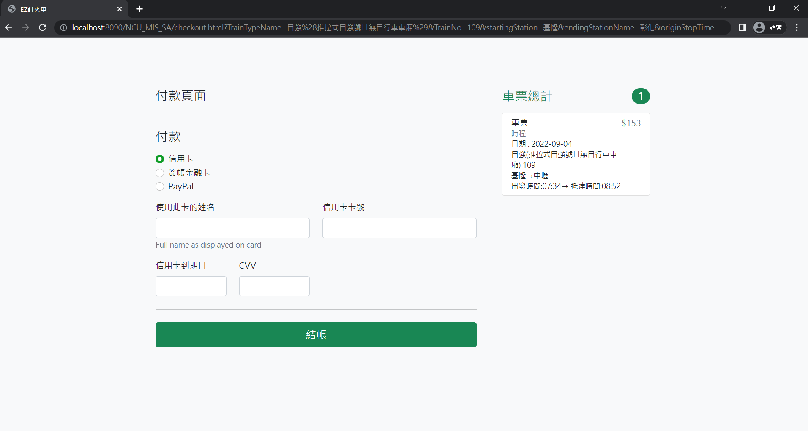

### 查詢我的車票
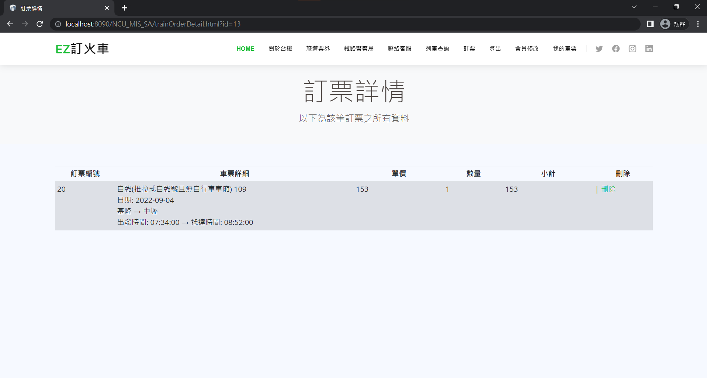

### 會員資料修改
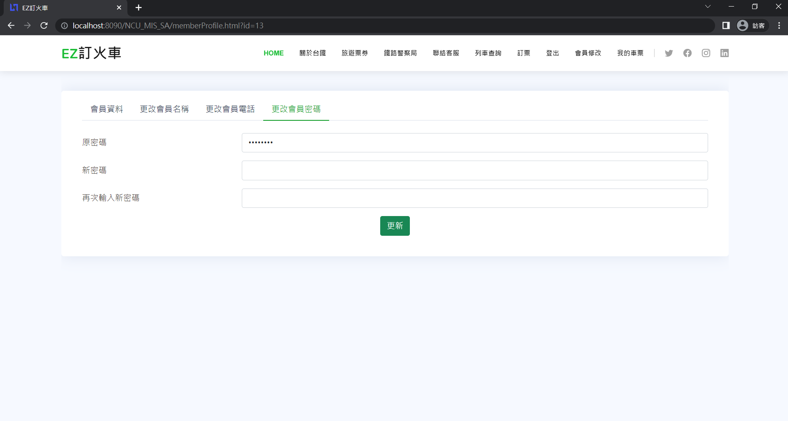
---
## 專案人員
- 資管三 鄭亦傑 資料庫設計、前後端串接ajax、後端java
- 資管三 陳彥邦 API、前端HTML、JavaScript
- 資管三 劉維仁 前端HTML
- 財金四 周歆晏 前端HTML、撰寫系統設計文件
- 資管三 林建佑 前端HTML、撰寫系統設計文件
- 資管三 葉卉翊 撰寫系統設計文件

 
 
  
